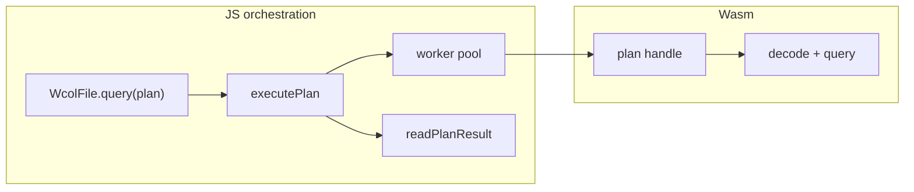

# Architecture

wcol splits **I/O and orchestration** (TypeScript) from **decode and compute** (Rust / Wasm). The optional `apps/explorer` demo adds a second Rust crate (`wcol-engine`) for UI state — it is not part of the core runtime.

## Core stack

| Layer | Location | Role |
|-------|----------|------|
| Public API | `src/index.ts`, `src/browser.ts` | `WcolFile`, `buildPlan`, browser entry |
| Orchestration | `src/runtime/exec/` | Chunk queue, page reads, worker pool, merge |
| Query model | `src/runtime/query/` | `QueryPlan` JSON → Wasm plan handle |
| Wasm compute | `rust/wcol-wasm`, `rust/wcol-decoder` | Decode pages, run filters / group-by / aggregates |
| Ingest | `rust/wcol-encoder`, `rust/wcol-cli` | Parquet → `.wcol`, native benchmarks |

**Rule:** JavaScript owns bytes and scheduling; Rust/Wasm owns columnar decode and query kernels.

## Query flow

1. `buildPlan({ ... })` — filters, `groupBy`, `aggregates`, `select`, `limit`.
2. Per chunk: read compressed pages → `plan_exec_chunk` in Wasm.
3. Main thread or worker pool runs chunks in parallel when the plan allows it.
4. Reducer merges partial row ids / aggregate state; projection materializes `SELECT` columns late.

## Multi-process execution

| Runtime | Mechanism |
|---------|-----------|
| Browser | `Worker` pool (`src/runtime/workers/`) — one Wasm instance per worker, shared plan via messages |
| Native CLI | Thread pool in `wcol-decoder` native runtime (`--workers N`) |

Invariants:

- One in-flight query per `WcolFile` (`queryChain` lock).
- Read all results before destroying the plan handle.
- Explicit `workers: N` disables silent fallback on worker error.

## Optional explorer app

`apps/explorer/` layers a Preact UI and `wcol-engine` (app state, CBOR patches, undo/redo) on top of the same `WcolFile` API. See [apps/explorer/README.md](../apps/explorer/README.md).

## Further reading

- [FORMAT.md](./FORMAT.md) — v7 on-disk layout
- [QUERY_AST_SUPPORTED.md](./QUERY_AST_SUPPORTED.md) — supported `QueryPlan` fields
- [BASELINE_COMMANDS.md](./BASELINE_COMMANDS.md) — benchmark and parity commands
