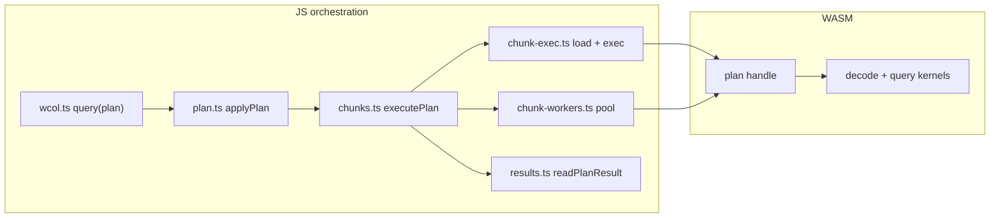

# Architecture boundaries

This repo has one **active product path** and several **experimental or archival** surfaces. See [repo-file-action-plan.md](./repo-file-action-plan.md) for file-level actions.

## Active path (browser prototype)

| Layer | Location | Role |
|-------|----------|------|
| Public API | `src/index.ts`, `src/browser.ts` | Stable JS/TS entrypoints |
| Orchestration | `src/runtime/exec/` (`chunks.ts`, `chunk-exec.ts`, `chunk-workers.ts`) | Chunk queue, page I/O, worker pool, result merge |
| Query model | `src/runtime/query/` (`plan-format.ts`, `plan.ts`, `filter-ops.ts`) | `QueryPlan` JSON → WASM plan handle |
| WASM compute | `rust/wcol-wasm`, `wcol-decoder` (`decode/`, `ffi/`, `query/`) | Decode and compute only |
| Format / ingest | `rust/wcol-encoder`, `rust/wcol-cli` | Encode and CLI tooling |

**Rule:** JS owns I/O and orchestration; Rust/WASM is compute-focused.

### Chunk execution flow

1. `plan.ts` / `applyPlan` — push filters, group keys, aggregates into a WASM plan handle.
2. `chunk-exec.ts` — per chunk: `plan_required_pages` → read compressed pages → `plan_exec_chunk`.
3. `chunks.ts` — prefetch queue, parallel workers when safe, reducer merge, `readPlanResult`.
4. `results.ts` — copy rows / aggregates / groups out of the plan; `projection.ts` decodes SELECT blob when `select` was set.

`WcolFile.query(plan)` creates the plan, runs `executePlan`, then destroys the plan **after** results are read.

### Orchestration invariants

| Invariant | Where |
|-----------|--------|
| One query at a time per file | `withContextLock` on `ctx.queryChain` in `chunks.ts` |
| Read results before `destroy_plan` | `readPlanResult` awaited inside `executePlan` / reducer path before `wcol.ts` destroys the main plan |
| Worker pool warm-up excluded from timings | `warmWorkers()` before parallel benchmarks (`perf-sanity`) |
| Parallel workers disabled when unsafe | No `PlanMsg` (SQL-only path), or `planUsesApproxDistinct` → local single-threaded scan |
| Worker failure → local fallback | `runChunkQuery` catch calls `runLocalChunks` only when `workers` was auto-detected (explicit `workers: N` throws) |

## Query surface (`QueryPlan`)

Single path: `buildPlan({ ... })` → `file.query(plan, { workers })`.

| Area | Supported | Notes |
|------|-----------|--------|
| Filters | `filters` + optional `combine` | `=`, comparisons, `between`, `in`, `like` (see `plan-format.ts`) |
| Group-by | 1–2 keys + aggregates | One aggregate spec per numeric column |
| Limit | `limit` | Early exit when row cap reached |
| SELECT (projection) | `select: ColumnRef[]` | Late materialize after scan: row ids first, then per-chunk decode of `select` columns only (`exec/projection.ts`, `ffi/materialize.rs`) |
| SQL | Worker `plan` message | Optional `sql` on worker path only; not in public `query()` |

### SELECT projection (v1)

1. Scan pass unchanged: filters (+ ORDER BY cols when used) → `plan.rows` global ids.
2. `plan_projection_begin` allocates columnar buffers sized to `plan.rows.len()`.
3. Main thread groups row ids by chunk, loads **select-only** pages (`plan_materialize_required_pages`), calls `plan_materialize_chunk`.
4. `plan_copy_row_projection` returns blob magic `WCOLpjv1` (SoA: f64 / dict-id / bool + null bytes per column).
5. `QueryResult.projection` — TypedArray views; dict columns store value ids (resolve via `getColumnDictValue` for display).

Historical AST design notes: [query-ast-and-engine-plan.md](./query-ast-and-engine-plan.md) (not exported).

### WASM ↔ TS boundary

Keep **typed binary FFI** (`withBytes`, `plan_copy_*`, chunk page descriptors). Do not add JSON/serde in WASM to “simplify” TS — that bloats the module and copies more than necessary. TS unmarshals plan results in `exec/results.ts` because the host needs JS objects; chunk payloads stay as `Uint8Array` + `Uint32Array` descriptors.

## Runtime layout (`src/runtime/`)

Naming: **kebab-case** directories and multi-word files; single-word modules stay unhyphenated (`plan.ts`, `chunks.ts`).

| Directory | Role |
|-----------|------|
| `core/` | `wcol.ts` (`WcolFile`), `context.ts`, `types.ts`, `constants.ts`, `refs.ts` |
| `io/` | `byte-source.ts`, `sources.ts`, `header.ts`, `pages.ts` |
| `wasm/` | `wasm.ts` (load/bindings), `helpers.ts`, `runtime-init.ts` |
| `schema/` | `columns.ts`, `dicts.ts` |
| `query/` | `plan.ts`, `plan-format.ts`, `filter-ops.ts` |
| `exec/` | `chunks.ts`, `chunk-exec.ts`, `chunk-workers.ts`, `results.ts`, `projection.ts` |
| `workers/` | `core.ts`, `protocol.ts`, `browser.ts`, `node.ts` |

## Native-only (not in wasm32 builds)

- `rust/wcol-decoder/src/native/` — threaded runtime, gated with `#[cfg(not(target_arch = "wasm32"))]` in `lib.rs`
- Archived experiments live under [`archive/experimental/`](../archive/experimental/README.md) (`simple`, `simple_wcol`, native orchestrators/kernels). They are **not** in the wasm build graph.

Do not wire archived or experimental engines into `lib.rs` or `wcol-wasm`.

## Browser demo (Phase 3)

| Piece | Location |
|-------|----------|
| UI | `demo/index.html`, `demo/app.js`, `demo/styles.css` |
| Bundle | `npm run demo` → `dist/browser/` (esbuild + WASM + copied demo) |
| Serve locally | `npm run demo:serve` → http://localhost:5173 |

The demo uses `WcolFile.open`, `warmWorkers`, and `query(plan)` against a local file or HTTP range URL.

## Isolate / freeze / archive candidates

| Category | Examples | Action |
|----------|----------|--------|
| Isolate | SQL API (`sql_api` feature), ClickBench scripts | Optional; not default browser story |
| Freeze | Historical `perf/` artifacts, one-off bench docs | No active evolution |
| Archive | `simple`, `simple_wcol`, native kernel orchestrator trees | Reuse ideas only; not product base |

## Plans

- Index: [prototype-plan-index.md](./prototype-plan-index.md)
- Stabilization gates: [minimal-wcol-stabilization-plan.md](./minimal-wcol-stabilization-plan.md)
- Baseline commands: [BASELINE_COMMANDS.md](./BASELINE_COMMANDS.md)
- Perf: [PERF_BASELINE.md](./PERF_BASELINE.md)
